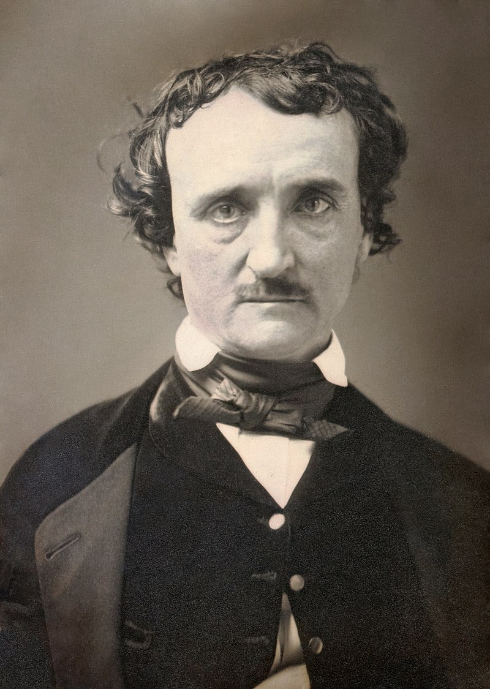
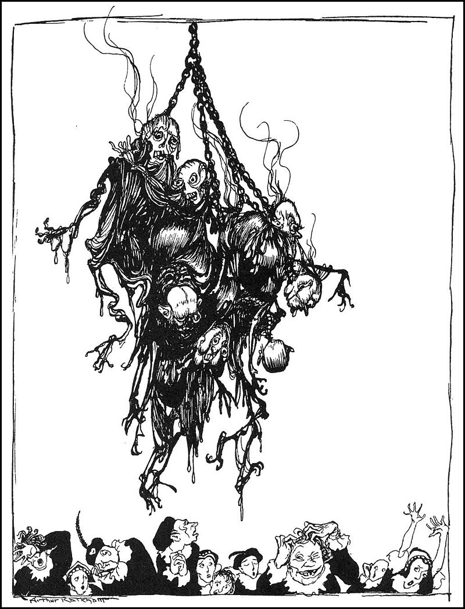

<h3> Introduzione </h3>
<p>Edgar Allan Poe (Boston, 1809 - Baltimora, 1849), è stato uno degli scrittori più influenti della storia americana e occidentale. La sua produzione spazia dalla prosa alla poesia, alla critica letteraria, la saggistica, fino al giornalismo.</br>
Come poeta è stato indubbiamente un esponente del Romanticismo, anticipando la figura del <i>poeta maledetto</i> (a causa dei problemi economici, personali, di alcolismo e di droga che lo afflissero e lo alienarono dalla società del suo tempo), figura che verrà poi sviluppata da Baudelaire e dal Simbolismo. In <i>The Raven</i>, 1845, il suo poema più famoso, un corvo fa visita all'Io poetico, distrutto dalla morte dell'amata Lenore, per dirgli che non potrà mai più rivederla (<i>Quoth the Raven, 'Nevermore'</i>, "disse il Corvo, 'mai più'").
</br>Della prosa di Poe fanno parte quasi settanta racconti brevi, esemplificativi della personalità eclettica e innovativa dello scrittore. Poe infatti è considerato l'apripista del giallo, in particolare quello focalizzato sull'aspetto psicologico, ma ha anche dato un enorme contributo alla letteratura gotica e dell'orrore, ma ha scritto anche storie di fantascienza ed avventura, nonché alcune umoristiche.
</br>Questo lavoro si pone l'obiettivo di analizzare i racconti brevi di Poe mediante tecniche di <i>text mining</i>, per ottenere informazioni sul linguaggio utilizzato, quanto esso è omogeneo, e come viene classificato dall'analisi automatizzata dei sentimenti.
</p>
<p>
{#id .class width=25% height=25%}
</p>
```{r setup, include=FALSE}
knitr::opts_chunk$set(
  eval = TRUE,
	message = FALSE,
	warning = FALSE,
	echo = FALSE
)
library(dplyr)
library(tidytext)
library(tidyverse)
library(stringr)
library(wordcloud)
library(SnowballC)
library(lubridate)
library(topicmodels)
library(reshape2)
library(textdata)
library(corrplot)
library(scales)
library(quanteda)
library(stm)
library(forcats)
library(stopwords)
library(plotly)
require(devtools)
install_github("Displayr/flipTime")
library(flipTime)

```


```{r datasets, include = FALSE}
dataset <- read.csv("C:/Users/atrem/iCloudDrive/De Universitatis Rebus/Advanced Data Science/Progetto ADS/preprocessed_data.csv", encoding = "UTF-8")
#view(dataset)

```


```{r unnest tokens}

#ripuliamo 
clean_stories <- dataset %>%
  select(title, text, classification, normalized_date) %>%
  rename(date=normalized_date)%>%
  mutate(name = sapply(title, as.character),
         text =  sapply(text, as.character), 
        classification =  str_replace_all(sub(",.*", "", sapply(classification, as.character)), regex("_"), " " ), monyear=date, date=AsDate(date)) %>%
  filter(classification!="Essay")%>%
  mutate(text = str_replace_all(text, regex("[:punct:]", ignore_case = TRUE), " "))
#clean_stories

#estrapoliamo i token e otteniamo tutte le parole
words0 <- clean_stories %>%
  select(name, text) %>%
  unnest_tokens(word, text)

stop_en <- as.data.frame(stopwords("en")) %>%
  rbind(c("upon"))
stop_fr <- as.data.frame(stopwords("fr"))
colnames(stop_en) <- c("word")
colnames(stop_fr) <- c("word")

stop <- stop_en %>%
   rbind(stop_fr)

#da qui eliminiamo le stopword inglesi e francesi
words <- words0 %>%
   anti_join(stop)

words_for_stories <- words %>%
   count(name, word, sort = TRUE)

#words_for_stories

words_frequencies <- words %>%
   count(word, sort = TRUE) 

#words_frequencies

```

<h3>I termini maggiormente presenti</h3>

<p>Possiamo facilmente visualizzare quali sono le parole più ricorrenti nell'insieme di tutti i racconti.</p>
```{r }
 
#le parole più usate
plot <- words_frequencies %>%
  arrange(desc(n)) %>%
  top_n(10, n) %>%
  ggplot(aes(x=reorder(word, n), y=n)) +
  scale_fill_brewer(palette = "Paired")+
  geom_col(show.legend = FALSE) +
  theme(legend.position = 'none')+
  coord_flip() +
  scale_x_reordered() +
  labs(y = "",
       x = "top terms")
ggplotly(plot, tooltip = "")

```

<p>Non risaltano termini particolari, ma la preponderanza delle parole <b>one</b> e <b>now</b>. La prima, soprattutto nell'inglese letterario dell'Ottocento, veniva usata per le frasi impersonali, quindi spesso rivolte al sé; questo è in linea con l'introspezione che permea molte delle storie di Poe. "Now" richiama l'immediatezza del pensiero, ma anche dell'azione, spesso fatale, commessa dai personaggi.</p>


<h3>I bigrammi più diffusi</h3>

<p>Per avere un'idea più concreta su come venga effettivamente utilizzato il linguaggio, analizziamo i bigrammi presenti almeno 20 volte all'interno dei singoli racconti.</p>

```{r}

bigrams <- clean_stories %>%
  unnest_tokens(bigram, text, token = "ngrams", n = 2) %>%
  count(name, bigram, sort = TRUE)

# rimuoviamo le stop word
bigrams_separated <- bigrams %>%
  separate(bigram, c("word1", "word2"), sep = " ")

bigrams_filtered <- bigrams_separated %>%
  filter(!word1 %in% stop$word) %>%
  filter(!word2 %in% stop$word)

# contiamo
bigram_counts <- bigrams_filtered %>% 
  count(word1, word2, sort = TRUE, wt = n)

# riuniamo i bigrammi
bigrams_united <- bigrams_filtered %>%
  unite(bigram, word1, word2, sep = " ")

plot <-bigrams_united %>%
  filter(n > 19) %>%
  arrange(desc(n))%>%
  group_by(name) %>%
  ungroup() %>%
  mutate(bigram = reorder_within(bigram, n, name))%>%
  ggplot(aes(bigram, n, fill=name)) +
  scale_fill_brewer(palette = "Paired")+
  geom_col(show.legend = FALSE) +
  coord_flip() +
  scale_x_reordered() +
  theme(legend.position='none')+
  labs(y = "",
       x = "bigrams occurring 20 times or more")
ggplotly(plot, tooltip = "name")


```

<p>Notiamo subito che sono preponderanti i nomi dei personaggi. In <i>Thou Art The Man</i>, 1844, il facoltoso Mr Shuttleworthy scompare misteriosamente, ed il suo nipote ed erede, Mr Pennifeather, viene arrestato per il presunto omicidio; Mr Goodfellow (chiamato anche "Old Charley"), suo amico, viene a sapere che la povera vittima gli aveva ordinato una cassa di vino pregiato, e quindi organizza una festa per gustarlo in compagnia; ma quando il narratore, conoscente degli altri personaggi, apre la cassa, vi trova il corpo senza vita della vittima, che "guarda" Goodfellow e mormora <i>Thou Art The Man</i> ("tu sei l'uomo"). A questo punto Goodfellow confessa di averlo ucciso e cade a terra, senza vita. Si viene a sapere quindi che in realtà era stato il narratore a scoprire la verità e ad orchestrare il tutto. Pur con i macabri particolari tipici di Poe, questo racconto rappresenta uno dei primi esempi di racconto giallo nella Storia della letteratura.</br>
Hop-frog è il nano di corte di un re particolarmente avvezzo agli scherzi. Alla corte c'è anche una nana, Trippetta, che il re, ubriaco, umilia buttandole addosso una coppa di vino mentre banchetta coi suoi ministri, dopodiché il sovrano chiede a Hop-Frog come lui ed il suo consiglio dovrebbero travestirsi per impressionare gli invitati alla festa che darà a breve. Il giullare propone loro di travestirsi da oranghi e farsi calare, incatenati tra di loro, dal soffitto. Il re accetta subito questa proposta, e alla festa il pubblico resta visibilmente sorpreso da tale trovata. Ma, anziché farli atterrare atterrare, Hop-Frog lascia re e consiglieri a mezz'aria, dopodiché dà fuoco ai loro costumi, trasformandoli presto in torce umane, e scappa via con Trippetta, mentre gli invitati restano inorriditi a guardare il macabro spettacolo. Questo racconto risale al 1849, pochi mesi prima della morte di Poe, quando era ormai in preda all'alienazione da alcolici e oppio.</br>

{#id .class width=25% height=25%}

Attraverso questo grafico quindi possiamo intuire che il lessico di Poe è in realtà variegato e molto curato. Ciò traspare anche dalla sua saggistica letteraria, dove si afferma l'idea che lo scrittore deve calcolare accuratamente ogni sentimento e ogni idea, e che un lavoro di qualità deve essere breve e concentrato ad ottenere uno specifico effetto.
</p>

<h3>Sentiment Analysis</h3>

<p>Secondo la critica letteraria, i temi più ricorrenti all'interno delle storie di Poe hanno sempre connotazioni tragiche: troviamo infatti <b>il contrasto tra la razionalità e la pazzia</b> (Auguste Dupin, in <i>The Murders of the Rue Morgue</i>, riesce a risolvere i casi di omicidi più disparati mettendo da parte le proprie emozioni e calandosi nei panni dell'assassino), <b>le tendenze ossessive </b> dei personaggi, che sono spesso nervosi, afflitti dalle fissazioni più disparate, che li portano alla rovina (in <i>The Oval Portrait</i>, ad esempio, il protagonista è un pittore talmente preso dal suo dipinto che trascura sua moglie fino a causarne la morte). </br>E proprio il <b>rapporto con la morte</b> è un'altra delle tematiche maggiormente importanti per Poe. I suoi personaggi ne sono spesso <i>ossessionati</i>, e quando per paura di essa cercano di evitarla a tutti i costi, ne rimangono inevitabilmente invischiati, come in <i>The Masque of the Read Death</i>, dove il Principe Prospero ed i suoi cortigiani cercano di segregarsi e barricarsi per sfuggire alla piaga della Morte Rossa, però la pestilenza si diffonde inevitabilmente e li stermina senza scampo.
</br> Infine non bisogna dimenticare il connubio, quasi onnipresente nel Poe-scrittore ma anche nella persona, tra <b>odio e amore</b>: la sua vita fu costellata di disgrazie, a partire da quando venne abbandonato dal padre e rimase orfano di madre poco tempo dopo, fino alla morte della moglie, vittima della tubercolosi nel 1847, che ne causò il tracollo della salute psicofisica e che lo porterà alla morte due anni più tardi. In <i>The Tell-Tale Heart</i>, l'anonimo narratore racconta la lucida pianificazione e l'esecuzione dell'efferato omicidio di un vecchio con "l'occhio di Vulture", lasciando tuttavia l'uditore completamente all'oscuro riguardo alla motivazione del delitto, anzi ripetendo diverse volte di amare il vecchio. </br>
Avendo chiaro quali sono le tematiche principali della prosa di Poe, possiamo cercare il sentimento prevalente in ciascun racconto e confrontarlo con il genere letterario al quale appartiene.
</p>

```{r}
nrc_sentiment <- get_sentiments("nrc")%>%
  filter(sentiment != "positive" & sentiment != "negative" )

nrc_words_total <- words %>%
  inner_join(nrc_sentiment)%>%
  count(name, sentiment)%>%
  rename(sentiment_words=n)

nrc_words_ratio <- words %>%
  group_by(name)%>%
  count(name)%>%
  inner_join(nrc_words_total, by="name")%>%
  mutate(ratio=sentiment_words / n)%>%
  select(-n, -sentiment_words)%>%
  arrange(name, desc(ratio))%>%
  top_n(1)
  

plot <- nrc_words_ratio %>%
  inner_join(select(clean_stories, name, classification, monyear, date))%>%
  ggplot(aes(date, ratio, colour=sentiment,
             text=paste0("Name: ", name, 
                         "\nDate: ", monyear, 
                         "\nClassification: ", classification,
                         "\nSentiment: ", sentiment, 
                         "\nRatio: ", ratio))) +
  scale_colour_brewer(palette = "Paired")+
  geom_point(show.legend = FALSE) +
 # scale_x_reordered() +
  labs(y = "",
       x = "")+
  theme_light()+
  theme(legend.position='none')
  
ggplotly(plot, tooltip = c("text"))
 

```
<p>Il sentimento prevalente di molte storie combacia con il genere letterario, infatti molti dei racconti horror sono caratterizzati dalla preponderanza della paura o della tristezza. Tuttavia ci sono casi che danno risultati inaspettati, anche se con una percentuale mediamente più bassa; ad esempio, in <i>The Assignation</i>, 1834, classificato come horror, prevale la gioia, ed in <i>William Wilson</i>, 1839, e <i>Hop-Frog</i>, 1849, la fiducia.</p>

<h3>Analisi su una Selezione di Storie</h3>
<p>A questo punto, selezionata una serie di racconti che secondo diverse fonti della critica letteraria risultano particolarmente significative, possiamo analizzarle più da vicino.
</p>
```{r}
name<- c("THOU ART THE MAN", "THE TELL-TALE HEART", "WILLIAM WILSON", "HOP-FROG", "THE MURDERS IN THE RUE MORGUE", "THE MASQUE OF THE RED DEATH", "THE ASSIGNATION", "THE BLACK CAT")
selected_stories<- data.frame(name)

selected_words<-words%>%
  inner_join(selected_stories, by = "name")

```


<p>Cominciamo cercando i 5 bigrammi più frequenti in ciascuno dei racconti selezionati.</p>

```{r}
selected_bigrams<- bigrams_united %>%
  inner_join(selected_stories, by="name")

#le parole più usate
plot <- selected_bigrams %>%
  arrange(desc(n)) %>%
  group_by(name) %>%
  slice(1:5) %>%
  ungroup() %>%
  mutate(bigram = reorder_within(bigram, n, name)) %>%
  ggplot(aes(bigram, n, fill=name)) +
  scale_fill_brewer(palette = "Paired")+
  geom_col( show.legend = FALSE) +
  facet_wrap(~ name, ncol = 2, scales = "free") +
  coord_flip() +
  scale_x_reordered() +
  theme_light()+
  theme(legend.position = 'none', axis.text.y = element_text(size=7, angle=45))+
  labs(y = "",
       x = "")
ggplotly(plot, tooltip="")
  
```
</br>
<p>
Da questi grafici possiamo effettivamente ricavare alcune informazioni centrali rispetto a ciascun racconto:
<ul>
<li>In <b>Hop Frog</b> il bigramma di gran lunga più presente è proprio quello del nome del protagonista, infatti sono le sue azioni a guidare l'andamento della storia e a portarla al suo macabro epilogo, seguito da <i>ourang outangs</i>, i costumi in cui il re ed i suoi ministri muoiono arsi vivi, e infine ci sono dei bigrammi che rappresentano le risate (ah ha ha ha), come dopotutto ci si può aspettare quando il protagonista è un giullare;</li>
<li>In <b>The Assignation</b> un uomo salva il figlio della Marchesa Mentoni, che è caduto nel Gran Canale di Venezia (quindi nei pressi del <i>palazzo ducale</i>); la donna gli dice che i due si incontreranno un'ora dopo il tramonto. Il narratore, un gondoliere, si offre di ospitare l'uomo, che alla sera beve uno strano liquido e collassa a terra. In quel momento arriva un servo di Casa Mentoni e urla che la Marchesa è morta;</li>
<li>In <b>The Black Cat</b> il protagonista, dopo essere caduto nella spirale dell'alcolismo, uccide il suo gatto nero impiccandolo, Pluto, ma quella stessa notte in casa sua scoppia un incendio che lo costringe a prendere, insieme alla moglie, e un'altra <i>casa costruita</i> da poco. Nel suo girovagare per bar, l'uomo <i>una notte</i> trova un gatto che assomiglia moltissimo a quello ucciso, tranne per una macchia bianca sul petto, e che lo segue a casa. Il protagonista prova rimorso e rabbia a guardare quella <i>orrenda bestia</i>, e quando, dopo qualche tempo, la macchia sul petto si tramuta in un cappio, comincia ad inseguirlo con un'ascia per ucciderlo, ma di fronte alla moglie che tenta di fermarlo, si sfoga invece su di lei. Decide di murare il cadavere, e anche il gatto sembra essere sparito nel nulla. Quando la polizia arriva ad indagare sulla scomparsa della donna, sentono un miagolio proprio da dietro il muro, e, bucatolo, trovano proprio il gatto sulla testa del corpo della vittima.</li>
<li>In <b>The Masque of the Read Death</b>, il <i>Principe Prospero</i> si rifugia in un'abbazia con 1000 nobili per sfuggire alla pestilenza della <i>Morte Rossa</i>, e organizza un ballo in maschera tra sette stanze, ognuna di un colore diverso (una di esse è <i>blu</i>). Al rintocco che segna la mezzanotte dell'<i>orologio d'ebano</i> nella camera nera, la maschera di un cadavere si palesa e si fa strada tra le camere; il principe Prospero l'affronta, ma muore sul colpo dopo aver emesso un grido; a questo punto gli altri nobili rimuovono la maschera per scoprire che non c'era un volto dietro di essa, ma era la Morte Rossa, e li uccide tutti;</li>
<li>In <b>The Murders in the Rue Morgue</b>, viene scoperto il duplice, efferato omicidio di una anziana madre e di sua figlia, nella loro casa. L'investigatore <i>Dupin</i>, analizzando la scena del crimine, capisce che l'autore del delitto non può essere stato un umano, ma piuttosto una scimmia, un <i>ourang outan</i>, e dunque pubblica un avviso sul giornale, al quale effettivamente risponde un marinaio che aveva portato un primate dal suo ultimo viaggio nel Borneo, il quale era però scappato via, e aveva infatti ucciso le due donne;</li>
<li>In <b>The Tell-Tale Heart</b>, il narratore s'insinua nella stanza del <i>vecchio</i> che dorme <i>ogni notte</i> per una settimana, e accende un lumino per vedere se il suo "occhio di vulture" sia aperto, e in tal caso ucciderlo. L'ottava notte il vecchio apre l'occhio, ed il suo cuore comincia a battere <i>sempre più forte</i>; a quel punto il narratore lo uccide, smembra il cadavere e lo nasconde sotto le assi del pavimento. Quando la polizia arriva ad indagare, siede con il narratore nella stanza del delitto, ma il narratore sente un ronzio che <i>cresce d'intensità</i> nell'orecchio e che associa al battito del vecchio, il che lo porta a crollare e confessare l'assassinio;</li>
<li>In <b>Thou Art The Man</b>, come abbiamo già visto, i bigrammi più frequenti sono relativi ai nomi dei protagonisti;</li>
<li>In <b>William Wilson</b>, racconto semi-autobiografico, <i>William Wilson</i> è un ragazzino che non accetta di prendersi responsabilità per le proprie azioni, e a scuola (dove è interessante notare che il preside, il <i>Dr Bransby</i> porta lo stesso nome del preside del collegio che Poe aveva frequentato) incontra un bambino che gli assomiglia in tutto e per tutto, si chiama William, e gli parla sussurrandogli, dandogli consigli su come comportarsi, cosa che lo irrita molto. Questa situazione si protrae per tutta la vita di William, fino a quando William, al colmo della rabbia, lo affronta con la spada e lo uccide, solo per scoprire che il suo "doppione" altro non era che la sua coscienza.</li>
</ul>
</br>In quasi tutti i casi vediamo, quindi, che l'analisi dei bigrammi principali costituisce una piccola mappa concettuale degli avvenimenti di ciascun racconto
</p>


<p>Costruendo la matrice con gli indici di correlazione di Pearson relativi ad ogni coppia di storie, la maggior parte delle coppie mostrano una correlazione positiva debole, quindi vuol dire che, nonostante molti racconti siano di argomento simile, il lessico usato varia.Solo in un caso, tra <i>William Wilson</i> e <i>The Murders of the Rue Morgue</i>, si raggiunge lo 0,6.</p>
```{r}
selected_words <- words %>%
  inner_join(selected_stories, by="name")

#non usiamo il set di parole completo, ma quello senza stop word
frequency <- selected_words %>%
  count(name, word, sort = TRUE) %>%
  group_by(name) %>%
  mutate(proportion = n / sum(n)) %>% 
  select(-n) %>% 
  spread(name, proportion) %>%
  select("word", "THOU ART THE MAN", "THE TELL-TALE HEART", "WILLIAM WILSON", "HOP-FROG", "THE MURDERS IN THE RUE MORGUE", "THE MASQUE OF THE RED DEATH", "THE ASSIGNATION", "THE BLACK CAT")

frequency_matrix <- cor(frequency[, c(-1)], use = "pairwise.complete.obs") %>%
  corrplot(method = "square")

```

<p>Curiosamente, si tratta di due storie molto diverse tra loro, essendo uno un racconto dell'orrore incentrato sulla doppia personalità del protagonista e l'altro un giallo.</br>
Possiamo provare a mettere a confronto le frequenze delle parole. La maggior parte dei termini con frequenze simili è composta da avverbi e alcuni verbi come "discovered", "left", "felt" e "thrown". Un particolare interessante è la posizione di "mind" al centro del grafo, con frequenze pressocché identiche per entrambi, come a rimarcare l'importanza della mente e del contrasto tra razionalità è irrazionalità, che dopotutto ritroviamo nelle due storie: In <i>The Murders in the Rue Morgue</i> è la prima che guida il processo mentale di Dupin e lo porta a risolvere il delitto, mentre in <i>William Wilson</i> è la parte irrazionale del protagonista che lo porta a uccidere la sua stessa coscienza. </p>

```{r}
  ggplot(frequency, aes(x = `THE MURDERS IN THE RUE MORGUE`, y = `WILLIAM WILSON`)) +
  geom_abline(color = "gray40", lty = 2) +
  geom_text(aes(label = word), check_overlap = TRUE, vjust = 1.5) +
  scale_x_log10(labels = percent_format()) +
  scale_y_log10(labels = percent_format()) +
  labs(y = "WILLIAM WILSON", x = "THE MURDERS IN THE RUE MORGUE") +
  theme_light()

```

<p>A questo punto può risultare interessante cercare la parola più presente all'interno del sentimento prevalente in queste storie. Il risultato sono parole che rimandano ad aspetti determinanti nella trama, come la <i>bestia</i> che il protagonista di <i>The Black Cat</i> vede nel felino e che lo porta alla rovina, il <i>battere</i> del cuore del vecchio, o la <i>scuola</i> in cui William incontra il suo sosia/coscienza, l'atto di <i>scoprire, trovare</i> di Auguste Dupin, tipico dell'investigatore, o il <i>bel</i> bambino della Marchesa che cade nel Canale, ma che richiama anche la bellezza delle scene evocate da Poe nella Venezia di <i>The Assignation</i>.</br>
Il fatto che il sentimento prevalente in certi casi non combaci con il genere indica che non tutti i racconti di Poe sono permeati da atmosfere inequivocabilmente cupe e macabre, ma talvolta l'orrore si consuma in contesti che sembrerebbero troppo lontani per esserne toccati, e quest'abilità dello scrittore statiunitense provoca un ulteriore effetto-sorpresa in chi sta leggendo.</p>
```{r}
#computo tutte parole storie selezionate
selected_total <- selected_words%>%
  group_by(name)%>%
  count(name)%>%
  rename(total=n)

#nome top sentiment ratio
selected_sentiment <- selected_words%>%
  inner_join(nrc_sentiment, by="word")%>%
  count(name, sentiment, sort=TRUE)%>%
  rename(sentiment_count=n)%>%
  inner_join(selected_total, by="name")%>%
  group_by(name, sentiment)%>%
  summarise(sentiment_ratio=sentiment_count/total)%>%
  arrange(name, desc(sentiment_ratio))%>%
  top_n(1)
  
#top word in top sentiment for story
nrc_selected_words_total <- selected_words %>%
  count(name, word)%>%
  filter(n > 2)%>%
  inner_join(nrc_sentiment)%>%
  inner_join(selected_sentiment, by=c("name", "sentiment"))%>%
  group_by(name)%>%
  filter(n==max(n))%>%
  slice(1:1)%>%
  arrange(desc(sentiment_ratio))%>%
  inner_join(select(clean_stories, name, classification))%>%
  select(name, classification, sentiment, word, sentiment_ratio)
 # as.data.frame()
 
  
  

nrc_selected_words_total
  
```

<h3>Topic Modelling</h3>

<p>Utilizzando il modello di allocazione Latent Dirichlet per il topic modelling, modello che vede ogni documento come insieme di topic e ogni topic come insieme di parole (il che rispecchoa maggiormente l'uso naturale del linguaggio, in cui i contenuti possono sovrapporsi in documenti diversi, anziché essere trattati come gruppi isolati), possiamo cercare di suddividere i contenuti di tutte le storie in due topic principali. In particolare cerchiamo il divario maggiore tra le beta (ovvero tra le probabilità di topic per parola) dei due topic, mediante il logaritmo in base 2 del rapporto tra la beta del primo e del secondo topic; maggiore è la beta del secondo topic, più il logaritmo del rapporto tenderà ad un numero positivo, viceversa il crescere della beta del primo topic risulterà in un numero negativo.
</p>

```{r topic1}

wdtm <- words %>%
  count(name, word, sort=TRUE)%>%
  #inner_join(nrc_sentiment, by="word")%>%
  rename(term = word, count = n) %>%
  cast_dtm(name, term, count)


wLDA <- LDA(wdtm, k = 2, control = list(seed = 1234))
wTopics = tidy(wLDA, matrix = "beta")

beta_spread <- wTopics %>%
  mutate(topic = paste0("topic", topic)) %>%
  spread(topic, beta) %>%
  # filter for relatively common words
  filter(topic1 > .001 | topic2 > .001) %>%
  mutate(log_ratio = log2(topic2 / topic1))

beta_spread %>%
  group_by(direction = log_ratio > 0) %>%
  top_n(10, abs(log_ratio)) %>%
  ungroup() %>%
  mutate(term = reorder(term, log_ratio)) %>%
  ggplot(aes(term, log_ratio, fill = direction)) +
  scale_fill_brewer(palette = "Paired")+
  geom_col(show.legend = FALSE) +
  labs(y = "Log2 ratio of beta in topic 2 / topic 1") +
  coord_flip()


```
<p>Mentre il secondo topic richiama maggiormente alle atmosfere cupe, agli omicidi, alla morte, il primo contiene parole più neutre. Un particolare interessante sta nel contrasto tra le due parole agli antipodi del grafico: il <i>cadavere</i>, lo stato in cui finiscono per ritrovarsi diversi personaggi, ed il <i>palloncino</i>, oggetto che fa tanto divertire i bambini. </p>

<h3>Conclusione</h3>
<p>L'impatto di Edgar Allan Poe sulla Storia della letteratura, ma anche sulla cultura popolare, è ancora oggi tra i più significativi degli ultimi secoli. Il suo contributo a generi quali le storie dell'orrore e i gialli,  è enorme, e senza di esso  tali generi, che oggi il pubblico ama tanto non solo in forma di libri, ma anche di film e di videogiochi, sarebbero probabilmente assai diversi, ma anche meno considerati.</br>
Grazie a questo lavoro di analisi automatizzata del linguaggio abbiamo ottenuto importanti indicazioni sulla scrittura di Poe, capace di provocare l'orrore, talvolta persino il disagio fisico, con poche, mirate espressioni, ed una grande cura del dettaglio per colpire il lettore quando meno se lo aspetta.
</p>
